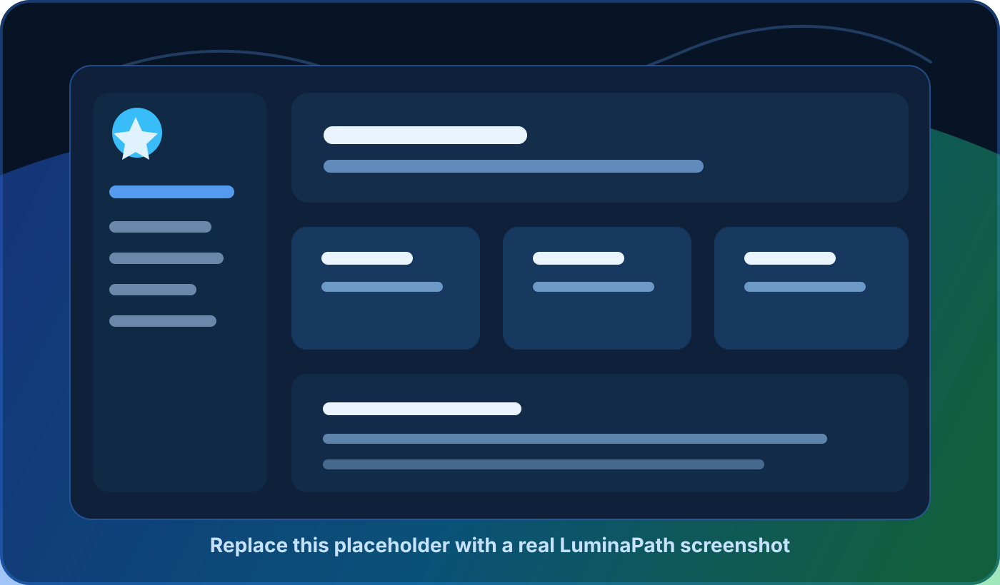

<div align="center">
  

  <h1>LuminaPath</h1>

  <p>
    <strong>Your game library, backlog, playtime tracker and quest board in one self-hosted command center.</strong>
  </p>

  <p>
    <a href="https://github.com/dominictosku/LuminaPath/stargazers">
      
    </a>
    <a href="https://github.com/dominictosku/LuminaPath/network/members">
      
    </a>
    <a href="https://github.com/dominictosku/LuminaPath/issues">
      
    </a>
    <a href="https://github.com/dominictosku/LuminaPath/actions/workflows/ci.yml">
      
    </a>
  </p>

  <p>
    
    
    
    
    
  </p>

  <p>
    <a href="#quick-docker-setup">Quick Start</a>
    <span> | </span>
    <a href="#features">Features</a>
    <span> | </span>
    <a href="#environment-variables">Configuration</a>
    <span> | </span>
    <a href="#cicd">CI/CD</a>
  </p>
</div>

> Screenshot note: replace `docs/images/app-screenshot-placeholder.svg` with your real app screenshot, or add `docs/images/app-screenshot.png` and update the image path above.

## Overview

LuminaPath is a personal game library, backlog planner, playtime tracker and quest-style productivity app. The main experience is an ASP.NET Core Blazor app with a PostgreSQL backend. An optional Ionic/Angular frontend is included for a mobile-style interface and can run against the same API.

<table>
  <tr>
    <td><strong>Library</strong><br />Catalog games, covers, platforms, genres and release dates.</td>
    <td><strong>Playtime</strong><br />Track manual hours next to third-party playtime such as PSN.</td>
    <td><strong>Quest Board</strong><br />Plan main quests, side quests, factions and real-life skill trees.</td>
  </tr>
  <tr>
    <td><strong>Dashboards</strong><br />See what you are playing, what is finished and what is ahead.</td>
    <td><strong>Imports</strong><br />Bring in data from Excel and PlayStation Network flows.</td>
    <td><strong>Self-hosting</strong><br />Run the backend, database and optional Angular app through Docker.</td>
  </tr>
</table>

## Features

- Game catalog with platforms, genres, release dates, cover images and estimated playtime.
- Personal game tracking with status, priority, rating, start/end dates and manual played hours.
- Manual playtime and third-party playtime stay separate, while the UI shows a combined total.
- Excel import/export for library and play history data.
- PlayStation Network import flow.
- Media document management for uploaded covers and files.
- RPG-style quest board with main quests, sub quests, faction quests and skill trees.
- Dashboard and statistics pages for played hours, completions and upcoming releases.
- ASP.NET Core Identity authentication with seeded administrator/editor roles.
- File-system storage by default, with Azure Blob support available through env vars.

## Tech Stack

| Layer | Tools |
| --- | --- |
| Backend | .NET 10, ASP.NET Core, Blazor Server, EF Core, Identity |
| Frontend | MudBlazor, Radzen, optional Ionic/Angular 21 |
| Data | PostgreSQL 17 |
| Deployment | Docker, Docker Compose, GitHub Actions, optional Azure Web App |
| Testing | xUnit |

## Quick Docker Setup

Copy the example environment file and adjust passwords/ports if needed:

```powershell
Copy-Item .env.example .env
```

Start the backend and PostgreSQL:

```powershell
docker compose up -d --build
```

Open the Blazor app/API at:

```text
http://localhost:8080
```

Start the optional Angular frontend too:

```powershell
docker compose -f docker-compose.yml -f docker-compose.frontend.yml up -d --build
```

Open Angular at:

```text
http://localhost:4200
```

The Angular container uses `/api` and proxies requests to the backend container, so browser/API communication works without local CORS pain.

Optional pgAdmin:

```powershell
docker compose -f docker-compose.yml -f docker-compose.tools.yml up -d
```

Open pgAdmin at `http://localhost:5050`.

## Environment Variables

All deployment-specific values are controlled through `.env` or normal ASP.NET environment variables.

Core Docker variables:

```text
BACKEND_HTTP_PORT=8080
FRONTEND_HTTP_PORT=4200
POSTGRES_PORT=5432
POSTGRES_DB=luminapath
POSTGRES_USER=luminapath
POSTGRES_PASSWORD=change-me
```

Backend variables:

```text
ASPNETCORE_ENVIRONMENT=Production
ConnectionStrings__Default=Host=db;Port=5432;Database=luminapath;Username=luminapath;Password=change-me;
RUN_MIGRATIONS_ON_STARTUP=true
HTTPS_REDIRECT=false
Storage__Provider=FileSystem
Storage__Path=/app/App_Data/storage
Cors__AllowedOrigins__0=http://localhost:4200
```

Azure Blob storage, if you do not want file-system storage:

```text
Storage__Provider=Azure
Azure__BlobConnectionString=...
Azure__BlobContainerName=media
```

Angular runtime variable:

```text
LUMINAPATH_API_ENDPOINT=/api
```

For the Docker frontend, `/api` is recommended because nginx proxies it to the backend service. Outside Docker, set it to something like `https://your-api.example.com/api`.

## Local Development Without Docker

Start PostgreSQL through Docker:

```powershell
docker compose up -d db
```

Run the Blazor backend:

```powershell
dotnet restore LuminaPath.sln
dotnet run --project src/LuminaPath/LuminaPath.csproj
```

Run the Angular frontend:

```powershell
cd src/LuminaPath.MobileApp
npm install
npm start
```

For local Angular development, edit `src/LuminaPath.MobileApp/src/assets/env.js` if you need a different API endpoint.

## CI/CD

GitHub Actions are split into two workflows:

- `CI`: restores, builds and tests the .NET solution, builds Angular, validates Compose and builds both Docker images.
- `Publish Containers`: publishes backend and frontend images to GitHub Container Registry on version tags like `v1.2.3` or manual dispatch.

Optional Azure App Service deployment is supported by setting these repository secrets:

```text
AZURE_CREDENTIALS
AZURE_WEBAPP_NAME
```

When `AZURE_WEBAPP_NAME` is present, the publish workflow deploys the API image to that Azure Web App.

## Seeded Login

Development seeding creates:

```text
Email:    admin@example.com
Password: Admin123*
```

Roles:

```text
Administrator
Editor
```

## Tests

```powershell
dotnet test Test/Test.csproj
```

On Windows, if another process locks normal build output, use:

```powershell
dotnet test Test/Test.csproj -p:OutDir=.\artifacts\test-out\
```
