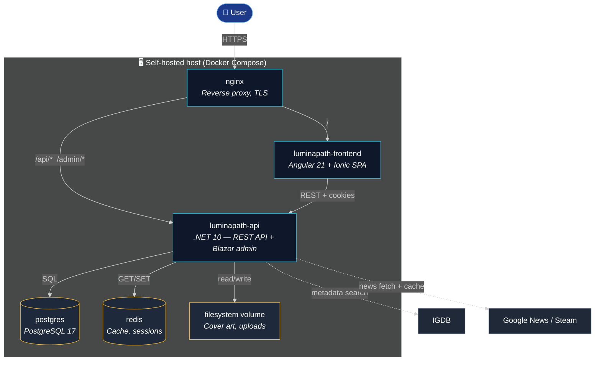

# C4 Level 2 — Containers

This zoom level shows the **deployable units** that make up LuminaPath. Each box is a separate process / image in [`docker-compose.yml`](https://github.com/dominictosku/LuminaPath/blob/main/docker-compose.yml).

## Containers in detail

### `luminapath-api`

- **Tech**: .NET 10, ASP.NET Core, EF Core, Blazor Server
- **Source**: [`src/LuminaPath/`](../../src/LuminaPath/), [`src/LuminaPath.Core/`](../../src/LuminaPath.Core/), [`src/LuminaPath.Infrastructure/`](../../src/LuminaPath.Infrastructure/)
- **Responsibilities**:
    - REST API consumed by the mobile app (`/api/*`)
    - Blazor admin UI (`/admin/*`)
    - Auth (cookie-based)
    - Integration with external catalog / news sources
    - Database migrations (run on startup, controlled by `RUN_MIGRATIONS_ON_STARTUP`)
- **State**: stateless beyond the request scope; persistence in Postgres / Redis / filesystem volume.

### `luminapath-frontend`

- **Tech**: Angular 21, Ionic, Capacitor
- **Source**: [`src/LuminaPath.MobileApp/`](../../src/LuminaPath.MobileApp/)
- **Responsibilities**:
    - The user-facing UI for everyday tracking (library, quests, planning, skill tree)
    - Talks to the API exclusively over REST
    - Capacitor wraps the same build for Android/iOS
- **Theming**: per-media-mode tokens (games = blue, anime = pink, movies = green, series = yellow). See [global.scss](https://github.com/dominictosku/LuminaPath/blob/main/src/LuminaPath.MobileApp/src/global.scss).

### `postgres`

- **Tech**: PostgreSQL 17
- **Schema**: managed by EF Core migrations in [`src/LuminaPath.Infrastructure/Migrations/`](../../src/LuminaPath.Infrastructure/)
- **Backup**: out of scope of this doc — see [runbooks](../05-runbooks/index.md).

### `redis`

- **Tech**: Redis
- **Use**: session store + cache for external API responses (news feed, IGDB lookups).

### `nginx`

- **Tech**: nginx
- **Config**: [`nginx/`](../../nginx/)
- **Role**: TLS termination, routing the mobile app and API behind one origin so cookies/CORS are simple.

## Deployment shapes

| Compose file | What it stands up | When to use |
|---|---|---|
| `docker-compose.yml` | API + DB + Redis | Production-shape backend |
| `docker-compose.frontend.yml` | + frontend SPA | Full stack on one host |
| `docker-compose.proxy.yml` | + nginx with TLS | Internet-facing |
| `docker-compose.tools.yml` | + dev utilities | Local debugging |

## Container-level decisions

- Why Blazor *and* Angular live in the same product — see [ADR-0002](../04-decisions/0002-blazor-admin-and-angular-app.md).
- Why media types are modelled separately instead of one polymorphic `Media` — see [`backend-media-types.md`](../backend-media-types.md).
