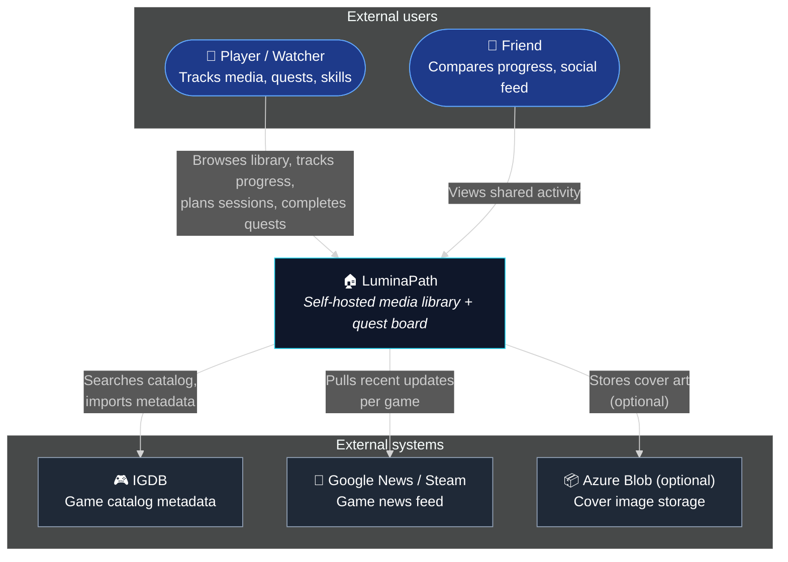

# C4 Level 1 — System Context

This diagram shows LuminaPath as a single box, the people who use it, and the systems it integrates with. It is intentionally light on technology — that's the next zoom level.

## Out of scope

- **Telemetry / analytics**: LuminaPath does not phone home. There is no third-party analytics SDK.
- **Email / push providers**: Not currently used. Achievement notifications are in-app only.
- **Payments**: Free, self-hosted, no billing path.

## Trust boundary

Everything inside the LuminaPath box is owned by the operator (the user, on their own hardware). External systems are treated as **untrusted** — responses are validated and cached server-side, and outages must degrade gracefully (the app keeps working without IGDB / news).
