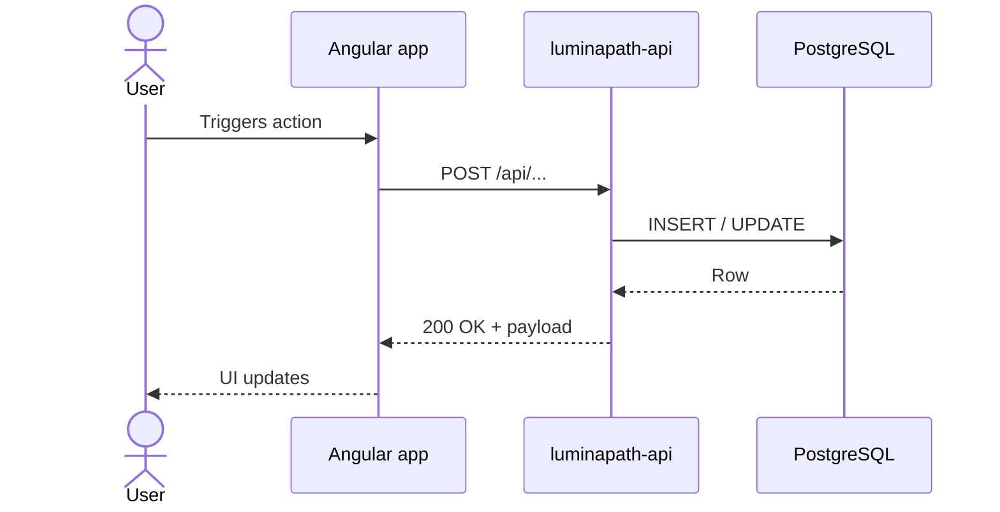

# Features

This section has one folder per user-facing feature. Each feature page should contain:

1. **What the feature does** (one paragraph, written for someone who has never seen it).
2. **Where it lives in the code** — links to the API controller, the Angular page, the EF Core entity.
3. **The happy-path sequence** — a Mermaid sequence diagram from user gesture to persisted state.
4. **Edge cases & known limitations** — what breaks, what's deferred, what's intentional.
5. **Related ADRs** — links into [Decisions](../04-decisions/index.md) for the *why*.

## Catalog

| Feature | Status |
|---|---|
| Library (games / movies / series / anime) | TODO — owner: — |
| Quest board | TODO |
| Skill tree | TODO |
| Planning / forecasting | TODO |
| Social feed | TODO |
| Achievements | TODO |

> Add a page here as the feature lands. Don't write speculative docs for things that aren't built yet — they rot the fastest.

## Sequence-diagram template

Copy this into a new feature page:

````markdown

````
