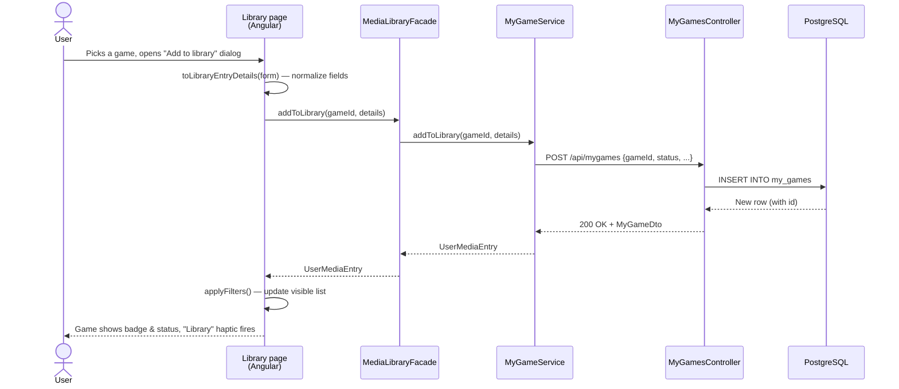
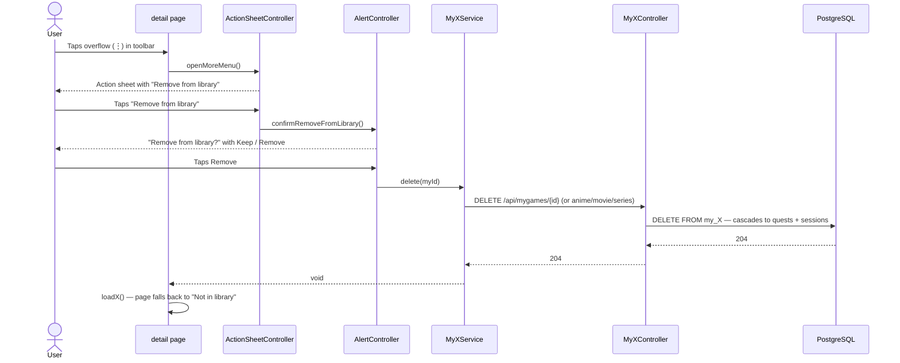

# Library

The library is where a user keeps track of every game, movie, series and anime they own, plan to consume, or have finished. Each library entry holds **status** (Planned / Playing / Completed / etc.), **rating**, **progress** (episode, playtime, dates) and free-form **personal notes**.

## Where it lives

| Concern | Path |
|---|---|
| Domain entities | [`src/LuminaPath.Core/Models/MyGame.cs`](../../src/LuminaPath.Core/Models/), `MyAnime.cs`, `MyMovie.cs`, `MySeries.cs` |
| Service layer (per type) | [`src/LuminaPath.Infrastructure/Services/ModelServices/`](../../src/LuminaPath.Infrastructure/Services/ModelServices/) |
| REST controllers | [`MyGamesController`](https://github.com/dominictosku/LuminaPath/blob/main/src/LuminaPath.Infrastructure/Controllers/MyGamesController.cs), `MyAnimesController`, `MyMoviesController`, `MySeriesController` (all extend `UserMediaController`) |
| Mobile library list | [`features/library/`](../../src/LuminaPath.MobileApp/src/app/features/library/) |
| Mobile detail pages | [`features/my-games/pages/my-game-details.page.ts`](../../src/LuminaPath.MobileApp/src/app/features/my-games/pages/), and the equivalent under `animes/`, `movies/`, `series/` |
| Shared media facade | [`features/library/services/media-library.facade.ts`](https://github.com/dominictosku/LuminaPath/blob/main/src/LuminaPath.MobileApp/src/app/features/library/services/media-library.facade.ts) |

The four media types share a structural pattern but are intentionally **not** unified into one polymorphic table — see [`backend-media-types.md`](../backend-media-types.md) for the rationale and the steps to add a new media type.

## Routes

| Action | Method + path |
|---|---|
| List my games | `GET /api/mygames` |
| Get one | `GET /api/mygames/{id}` |
| Add to library | `POST /api/mygames` |
| Update (status, rating, dates, episode, notes) | `PUT /api/mygames/{id}` |
| Remove from library | `DELETE /api/mygames/{id}` |

Same shape for `myanimes`, `mymovies`, `myseries`. Full schema in [Swagger](../02-architecture/api-reference.md).

## Happy path — adding a game to the library



## Happy path — advancing one episode (anime / series)

```mermaid
sequenceDiagram
    actor User
    participant Page as anime-details.page
    participant Svc as MyAnimeService
    participant API as MyAnimesController
    participant DB as PostgreSQL

    User->>Page: Taps "Watch ep. N/M"
    Page->>Page: Compute next episode + status<br/>(bump status to Watching;<br/>set Completed + endDate if last)
    Page->>Svc: updateLibraryEntry(myAnimeId, animeId, patch)
    Svc->>API: PUT /api/myanimes/{id}
    API->>DB: UPDATE my_animes SET current_episode, status, end_date
    DB-->>API: Updated row
    API-->>Svc: 200 OK + MyAnimeDto
    Svc-->>Page: MyAnimeDto
    Page->>Page: loadAnime(animeId) — refetch full state
    Page-->>User: Progress bar moves, primary action label updates
```

## Happy path — removing from library



## Edge cases & known limitations

| Case | Behaviour |
|---|---|
| Add to library while offline | Fails silently — the calling code swallows the error. UX could use a retry banner. |
| Episode count unknown (`totalEpisodes = 0`) | "Watch episode N" still works; status never auto-bumps to Completed (no end marker). |
| Already at last episode | Primary action becomes **Mark completed**; tapping again with status=3 turns into **Replay** (reset to ep 0, status=Watching). |
| Personal notes (markdown) | Rendered client-side; server stores plain text. No image embeds, no scripts. |
| Library entry for a DLC | The DLC has its own `MyGame` row; the parent game's library status is independent. |
| Delete cascade | Removing from library also drops linked quests and gaming sessions. This is intentional but irreversible — alert copy reflects that. |

## Theming

Library pages use the global `--app-chrome-*` and `--app-theme-accent-*` tokens defined in [`global.scss`](https://github.com/dominictosku/LuminaPath/blob/main/src/LuminaPath.MobileApp/src/global.scss). When the active `body.theme-*` class changes (driven by `MediaModeService`), the same component re-skins automatically — games are blue, anime pink, movies green, series yellow.

## Related ADRs

- [`backend-media-types.md`](../backend-media-types.md) — why every media type has its own table.
- [ADR-0002](../04-decisions/0002-blazor-admin-and-angular-app.md) — why the user-facing library lives in Angular, not Blazor.
