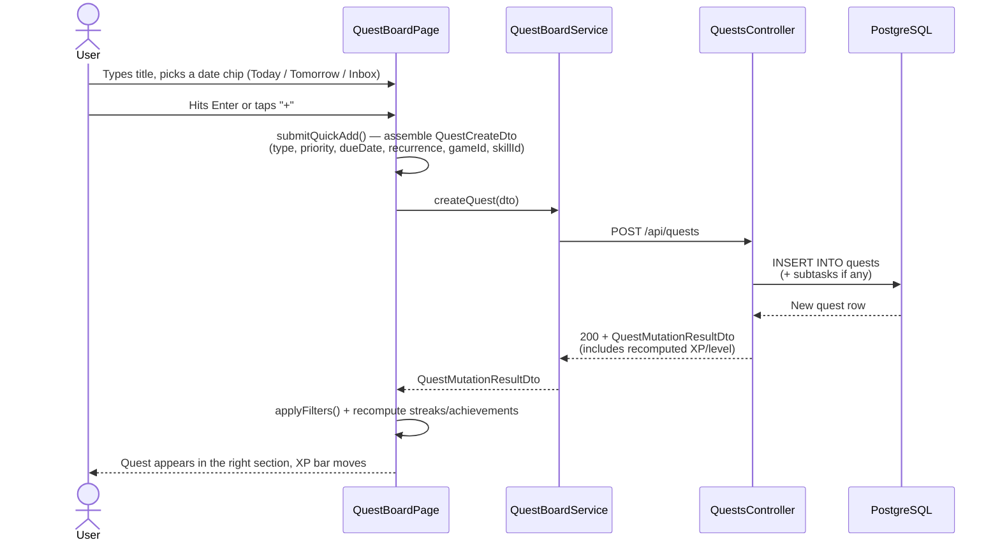
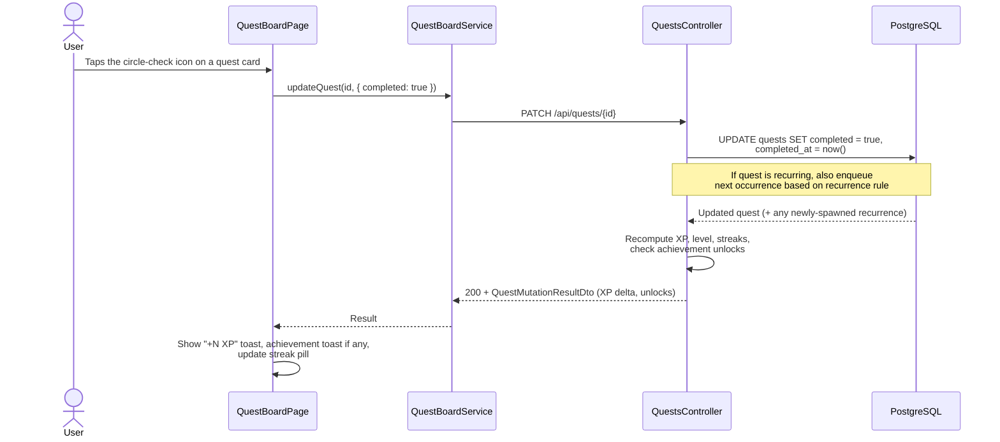
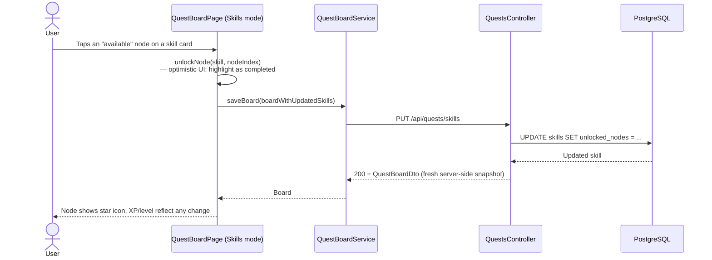

# Quest board

The quest board is the user's daily-driver list of things to do — both real-life tasks (Today / Tomorrow / Inbox) and tasks linked to a specific game or skill. It also hosts the **Skills** view (mastery cards with TRAIN / NODE actions) and the **Skill Tree** view (the 3D path visualization).

A "quest" is a small unit of intent. Quests are typed (`main` / `sub` / `faction`), prioritised, can recur, can be linked to a `MyGame` or a `Skill`, can have **subtasks**, can be **tagged**, and yield **XP** on completion which feeds the user's level and any linked skill's progress.

## Where it lives

| Concern | Path |
|---|---|
| Domain entities | [`src/LuminaPath.Core/Models/Quest.cs`](../../src/LuminaPath.Core/Models/), `Skill.cs`, `QuestSubtask.cs` |
| Service | [`src/LuminaPath.Infrastructure/Services/ModelServices/QuestService.cs`](../../src/LuminaPath.Infrastructure/Services/ModelServices/) |
| Controller | [`QuestsController`](https://github.com/dominictosku/LuminaPath/blob/main/src/LuminaPath.Infrastructure/Controllers/QuestController.cs) |
| Page | [`features/quests/pages/quest-board.page.ts`](../../src/LuminaPath.MobileApp/src/app/features/quests/pages/) |
| Service (client) | [`features/quests/services/quest-board.service.ts`](../../src/LuminaPath.MobileApp/src/app/features/quests/services/) |
| Skill tree component | [`features/skill-tree/`](../../src/LuminaPath.MobileApp/src/app/features/skill-tree/) (lazy-loaded) |

## Three modes

The page is a single component with a top-level segment switching between:

| Mode | What you see |
|---|---|
| **Quests** | The flat list of quests, grouped into Today / Overdue / Upcoming / Inbox sections, with a quick-add row at the top and filter/search/tag chips. |
| **Skills** | Three-column grid of skill cards (icon, level, XP, TRAIN / NODE buttons, node list). Cards now use the dark-blue chrome by default and inherit the active theme accent. |
| **Tree** | A 3D skill tree visualization (deferred lazy-load — only fetches when the viewport reaches it). |

## Routes

| Action | Method + path |
|---|---|
| Load the whole board for the user | `GET /api/quests/board` |
| Persist the skills list (icons, colors, nodes) | `PUT /api/quests/skills` |
| Get quests linked to one game | `GET /api/quests/for-game/{myGameId}` |
| Create quest | `POST /api/quests` |
| Update quest | `PATCH /api/quests/{id}` |
| Delete quest | `DELETE /api/quests/{id}` |
| Reorder (drag-to-sort) | `PUT /api/quests/reorder` |
| Add subtask | `POST /api/quests/{questId}/subtasks` |
| Update subtask | `PATCH /api/quests/{questId}/subtasks/{subtaskId}` |
| Delete subtask | `DELETE /api/quests/{questId}/subtasks/{subtaskId}` |

Full schema in [Swagger](../02-architecture/api-reference.md).

## Happy path — adding a quest via quick-add

## Happy path — completing a quest

## Happy path — unlocking a skill node

## Edge cases & known limitations

| Case | Behaviour |
|---|---|
| Quick-add with empty title | `submitQuickAdd()` no-ops. |
| Drag-to-reorder while filtered | Disabled — `isManualOrderActive` only true on the "all" view. Mixing custom order + filter would be misleading. |
| Recurring quest completed | Server marks the current instance done **and** spawns the next instance with the new due date. |
| Delete with linked subtasks | Cascades. The undo toast offers an "Undo" path within ~5s. |
| Skill node clicked when locked | No-op (visual feedback only). User must complete the prior node first. |
| Skill tree mode entered without viewport hit | Component is `@defer (on viewport)` — the 3D bundle (~1.3MB) only downloads when the segment is visible. |
| Achievements unlocked off-screen | A toast surfaces from the bottom; click to dismiss. Underlying achievement list lives in the same component state. |

## Theming

The skill cards explicitly use `var(--accent)` / `var(--accent-strong)` / `var(--accent-soft)` from the page-level dark-blue tokens, with `--skill-color` overriding the accent per-card based on the user's chosen colour. This means cards stay legible against the dark chrome even when the skill colour is a saturated red or yellow.

## Related ADRs

- [ADR-0001](../04-decisions/0001-record-architecture-decisions.md) — why decisions like the skills-as-cards layout are tracked here.
- [ADR-0002](../04-decisions/0002-blazor-admin-and-angular-app.md) — why the quest board lives in Angular.
